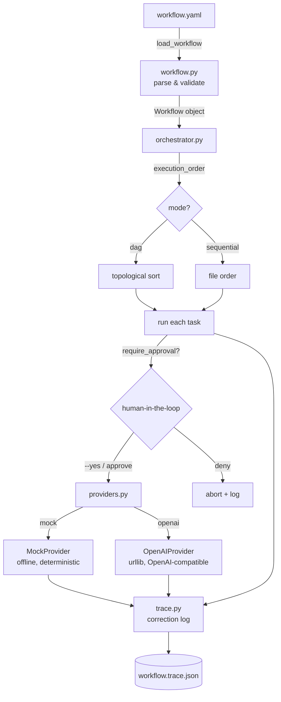

# AgentForge

**A lightweight multi-agent workflow orchestration CLI — offline by default.**

AgentForge lets you describe a small team of LLM-powered agents and the tasks
they collaborate on in a single YAML file, then runs that workflow as a
dependency-aware DAG. It ships with a deterministic **mock provider**, so the
whole thing runs end-to-end with **no API key and no internet** — and an
**OpenAI-compatible provider** for real models when you want them.

It is inspired by tools like CrewAI and n8n, but is 100% original, dependency-light
code: **standard library + PyYAML only**.

[](LICENSE)


---

## 繁體中文摘要 (Traditional Chinese Summary)

**AgentForge 是一個輕量級的多代理（multi-agent）工作流程編排命令列工具。**

你只需要在一個 YAML 檔案中定義「代理」（agents：角色、目標、背景故事、模型）
與「任務」（tasks：描述、負責的代理、相依關係、輸出變數），AgentForge 就會：

- 依照相依關係（DAG 拓撲排序）或循序模式執行任務；
- 內建 **mock 模擬模型**，完全離線、不需 API 金鑰即可執行示範與測試；
- 支援 **OpenAI 相容**的端點（可自訂 `base_url`、`model`，並從環境變數讀取金鑰）；
- 提供 **人機協作檢查點**（`require_approval`）：互動模式下會暫停並請使用者確認，
  並可用 `--yes` 旗標在 CI／示範時自動核准；
- 將每一步的輸入、模型、輸出與耗時寫入 JSON「修正日誌」（correction log），
  方便檢查與反覆改進。

**快速開始：**

```bash
pip install -e .
python -m agentforge init
python -m agentforge validate workflow.yaml
python -m agentforge run workflow.yaml --yes --provider mock
```

---

## Why AgentForge?

- **Runs anywhere, instantly.** No API key, no network — the built-in mock
  provider produces coherent, role-aware output so you can build, demo and
  test pipelines on a plane.
- **Declarative.** Your whole multi-agent system is one readable YAML file.
- **Real dependencies.** Tasks form a DAG; AgentForge runs them in correct,
  deterministic topological order (or sequentially if you prefer).
- **Humans in the loop.** Mark any task `require_approval: true` to pause for
  confirmation — perfect for "review before publishing" steps.
- **Auditable.** Every run produces a JSON **correction log** capturing inputs,
  provider/model, output and timing for each step.
- **Tiny.** Standard library + PyYAML. Easy to read, audit and extend.

## Install

Requires Python 3.9+.

```bash
git clone https://github.com/VictorLin/agentforge.git
cd agentforge

# Option A: editable install (gives you the `agentforge` command + deps)
pip install -e .

# Option B: just the dependency, run as a module
pip install -r requirements.txt
```

## Quickstart

Copy-paste these commands — they work fully offline:

```bash
# 1. Scaffold an example workflow
python -m agentforge init

# 2. Validate it (checks schema, references, and the DAG for cycles)
python -m agentforge validate workflow.yaml

# 3. Run it with the offline mock provider, auto-approving checkpoints
python -m agentforge run workflow.yaml --yes --provider mock
```

Or run the bundled example directly:

```bash
python -m agentforge run examples/workflow.yaml --yes --provider mock
```

After a run you'll get a `*.trace.json` correction log next to your workflow.

If you installed with `pip install -e .`, you can drop `python -m` and just use
`agentforge init`, `agentforge run ...`, etc.

### Using a real model (OpenAI-compatible)

The OpenAI provider works with OpenAI, Azure OpenAI, Ollama, vLLM, LM Studio
and anything else that speaks the `/v1/chat/completions` API.

```bash
export OPENAI_API_KEY="sk-..."          # required for real calls
export OPENAI_BASE_URL="https://api.openai.com/v1"   # optional override
export OPENAI_MODEL="gpt-4o-mini"        # default model if an agent omits one

python -m agentforge run workflow.yaml --yes --provider openai
```

Set each agent's `model:` in the YAML to pick a model per agent. (For a local
Ollama server, e.g. `OPENAI_BASE_URL=http://localhost:11434/v1` and
`OPENAI_API_KEY=ollama`.)

## Architecture



### Module map

| File                       | Responsibility                                              |
| -------------------------- | ----------------------------------------------------------- |
| `agentforge/cli.py`        | `argparse` CLI: `init`, `validate`, `run`.                   |
| `agentforge/workflow.py`   | Data model, YAML loading, validation, topological sort.     |
| `agentforge/orchestrator.py` | Runs tasks in order, templating, approvals, tracing.      |
| `agentforge/providers.py`  | `MockProvider` (offline) and `OpenAIProvider` (urllib).     |
| `agentforge/trace.py`      | `RunTrace` / `StepRecord` — the JSON correction log.        |
| `agentforge/__main__.py`   | `python -m agentforge` entry point.                         |

### How execution works

1. **Load & validate.** The YAML is parsed into typed `Agent`/`Task`/`Workflow`
   objects. Validation catches missing fields, unknown agent/task references,
   duplicates, self-dependencies and dependency **cycles** — before any model
   is called.
2. **Order.** In `dag` mode tasks are topologically sorted (Kahn's algorithm,
   ties broken by declaration order for reproducibility). In `sequential` mode
   they run in file order.
3. **Template.** Each task description can reference upstream outputs via
   `{{ output_var }}`. The orchestrator substitutes the shared context; unknown
   variables become a visible `[missing: var]` marker (the run still proceeds).
4. **Approve.** If `require_approval: true`, the orchestrator pauses for console
   confirmation — unless `--yes` auto-approves (for CI/demos).
5. **Run & trace.** The chosen provider generates output, which is stored under
   the task's `output_var` for downstream tasks, and every step is appended to
   the correction log.

## Configuration

### Workflow file

```yaml
name: My Workflow
description: What it does
mode: dag            # "dag" (honour depends_on) or "sequential" (file order)

agents:
  - name: researcher          # unique id referenced by tasks
    role: Senior Researcher   # required
    goal: Find accurate facts # optional
    backstory: Loves sources  # optional
    model: mock               # provider-specific model name

tasks:
  - name: research            # unique id
    description: Research X    # the instruction (supports {{ var }})
    agent: researcher         # which agent runs it
    output_var: notes         # store output under this name (optional)

  - name: write
    description: "Write using: {{ notes }}"
    agent: writer
    depends_on: [research]    # DAG edges (optional)
    output_var: draft
    require_approval: true     # human-in-the-loop checkpoint (optional)
```

### Environment variables (OpenAI provider)

| Variable          | Default                       | Purpose                        |
| ----------------- | ----------------------------- | ------------------------------ |
| `OPENAI_API_KEY`  | _(none)_                      | Required for real API calls.   |
| `OPENAI_BASE_URL` | `https://api.openai.com/v1`   | Override for compatible APIs.  |
| `OPENAI_MODEL`    | `gpt-4o-mini`                 | Default model if agent omits.  |

### CLI reference

```text
agentforge init [path] [--force]          Scaffold an example workflow.yaml
agentforge validate <file>                Validate a workflow file
agentforge run <file> [--yes]             Run a workflow
                      [--provider mock|openai]
                      [--trace PATH]       Where to write the correction log
```

## The correction log

Each run writes a JSON file (default `<workflow>.trace.json`) recording, per step:
the task and agent, the resolved provider and model, the rendered prompt, the
output, status, approval decision, timestamps and duration. Treat it as a
*correction log*: a replayable record for spotting where a result went wrong and
iteratively improving prompts, dependencies or approval gates.

## Development & tests

```bash
pip install -e ".[dev]"   # or: pip install pytest pyyaml
pytest
```

Tests cover DAG ordering and cycle detection, validation errors, mock-provider
runs, context templating, approval/denial flows and the end-to-end CLI.

## Roadmap

- [ ] Parallel execution of independent DAG branches (thread pool).
- [ ] Retry / backoff policies per task.
- [ ] Resume a run from a previous correction log.
- [ ] More built-in providers (Anthropic-style, local GGUF runners).
- [ ] Per-task tools / function calling.
- [ ] Cost and token accounting in the trace.
- [ ] `agentforge graph` to render the DAG as Mermaid/Graphviz.

## License

MIT © 2026 VictorLin. See [LICENSE](LICENSE).
